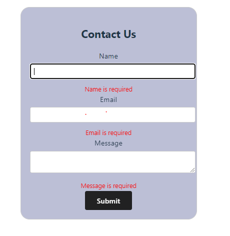
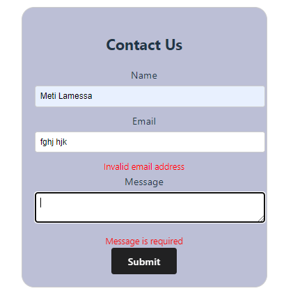

# Contact Form using React and TypeScript

This is a simple contact form built using React, TypeScript, and the useForm hook from react-hook-form.

# Features

- Simple and responsive contact form
- Validates required fields and email format
- Displays error messages for invalid inputs

# Installation

1. Clone the repository
2. Run npm install to install dependencies
3. Run npm run dev to start the application

# Usage

The form collects the user's name, email, and message. It validates the inputs and displays error messages if the inputs are invalid. Upon successful submission, the form data is logged to the console.

# SCREENSHOTS:

