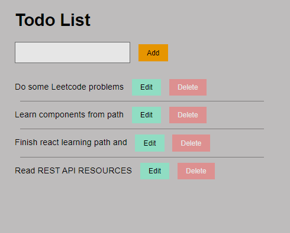
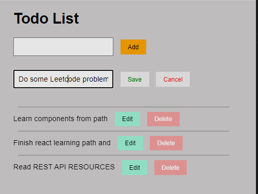

This is a Todo List application built using HTML, CSS, typescript, and react. Users can add new tasks and delete existing ones by simply clicking on the task item.

INSRUCTIONS:

1.on terminal run: ```npm run dev```

2.Enter a new task in the input field at the top of the page.

3.Click the "Add Task" button to add the task to the list and To edit task click "edit" button and save changes made by clicking "save" button.

4.To delete a task, click "Delete" button.

SCREENSHOT:



